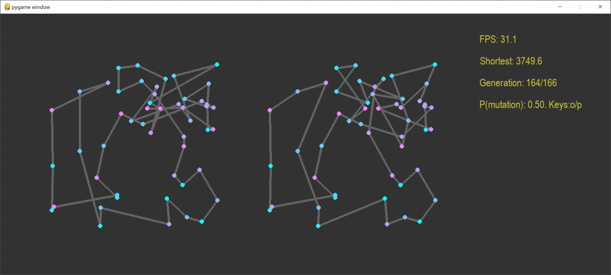

## Genetic algoriths

Implementation of genetic algoritmhms to find a good solution to the [traveling salesman problem](https://en.wikipedia.org/wiki/Travelling_salesman_problem)



## Requirements

python >= 3.7

## Installation

```
$ pip install -r requirements.txt
```

## Running

See available command-line options by running

```
$ python gen.py --help
```

The window will show the performance of the best chromosome of the current generation, and the performance of the overall best chromosome. 

**Controllers**

By pressing **p/o**, you can control the probability of a mutation happening. A mutation, in this case, swaps two genes in the chromosome.

